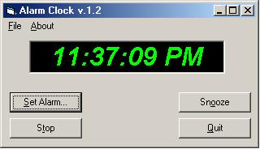



## A Simple Alarm Clock

### Description

Just a simple alarm clock. It will either display a message box (silent alarm) or play a music file at a pre-defined time
 
### More Info
 

             |
---                |---
**Submitted On**   |2001-09-13 18:55:52
**By**             |[Dave Lake](https://github.com/Planet-Source-Code/PSCIndex/blob/master/ByAuthor/dave-lake.md)
**Level**          |Beginner
**User Rating**    |4.6 (23 globes from 5 users)
**Compatibility**  |VB 6\.0
**Category**       |[Complete Applications](https://github.com/Planet-Source-Code/PSCIndex/blob/master/ByCategory/complete-applications__1-27.md)
**World**          |[Visual Basic](https://github.com/Planet-Source-Code/PSCIndex/blob/master/ByWorld/visual-basic.md)
**Archive File**   |[A Simple A264019142001\.zip](https://github.com/Planet-Source-Code/dave-lake-a-simple-alarm-clock__1-27224/archive/master.zip)

